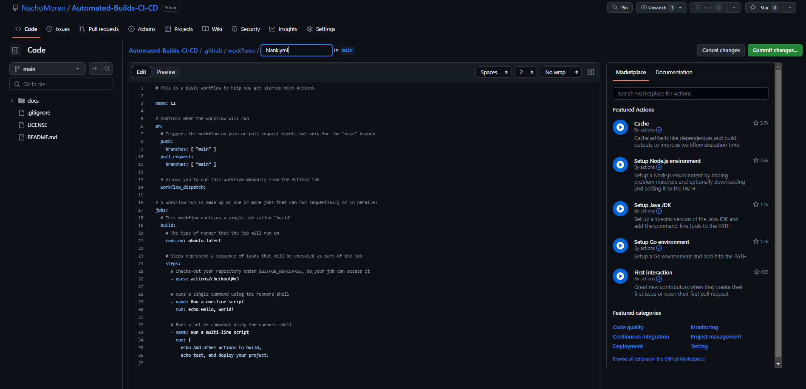

# Automated Builds CI + CD
In software development, building is the process that describes the conversion of files and other assets to create a software product that works in its intended form. This procedure includes compiling source files, packaging compiled files into compressed formats, producing installers and creating or updating database schemas. So, whenever we talk about an automated build, it means that there is no human intervention during this building process. Build automation is possible when the steps involved in the build are repeatable and can be performed using just the information that has already been stored in the source code control repository by the developers. Furthermore, build automation is a first step of any CI/CD process. 


## Continuous Integration (CI)
Continuous integration (CI) is the practice of automating the integration of code changes from multiple contributors into a single software project. It allows the developers to frequently merge code changes into the central repository where builds and tests will run. 
The goal of including CI in your project is to reduce the problems generated while working simultaneously on the same project. In order to make this happen, it is necessary to separate properly the work of each contributor and try to encapsulate changes in order to integrate them in a regular way. 


## Continuous Delivery and Continuous Develpoment(CD)
Continuous delivery is an extension of continuous integration, since it automatically deploys all code changes to a testing and/or production environment after the build stage. This means that you have an automated release process and you can deploy your app any time by clicking a button. 
Even if there is not established a quantity of time between two releases, in order to get as much benefit as possible from continuous delivery, you should deploy to production as early as possible. 

On the other hand, continuous deployment goes a step further than continuous delivery. With continuous deployment, every change done that passes all the tests and all the stages will be released to the customers. Working this way is an excellent way to accelerate the feedback loop with customers. 


## Comparison between different CI/CD tools
### 1. [GitHub Actions](https://github.com/features/actions)
GitHub Actions is a CI/CD tool provided within GitHub. Workflows can be automated, customized, and executed right within GitHub repositories, which added to the generous free tier makes GitHub Actions the best tool for testing CI/CD pipelines and for small projects.


### 2. [Jenkins](https://www.jenkins.io)
Jenkins is an open-source project written in Java that runs on Windows, macOS, and Linux, and can be installed locally or in cloud environments. Originally, it was designed for continuous integration, now it covers the entire CI/CD pipeline. It has a powerful set of features that can automate tasks related to building, test, deployment, integration, and release of the software. Furthermore, since it is an open source and it has a big and helpful community, Jenkins is a great option for beginners. 


### 3. [CircleCI](https://circleci.com)
CircleCI is one of the world’s most used CI/CD platforms, processing over a million builds daily. It comes as a software-as-a-service offering but also can be installed on your hardware or private cloud. As key features, CircleCI has numerous pre-built integrations and you can find answers to practically any question within the CircleCI documentation.


### 4. [GitLab](https://about.gitlab.com)
GitLab is another popular tool for DevOps which is based on the web and also features a Git repository manager. It is a platform for automating developer workflows and CI/CD is just one of the many workflows it offers. It has a very competitive free plan bringing you most of GitLab's potential with 400 minutes of CI/CD per month. It may be another great option for beginners.


## Set up a CI/CD environment with GitHub Actions
### Basic concepts
#### Workflows
Workflows are all the processes of build automation. They are an automated procedure made up of one or more jobs that is added to a repository and can be triggered by an event. They are defined using yaml. or yml. files and with it you can build, test, package, release, or deploy our code on GitHub. For instance, if someone creates an issue, we still have to rate it as a major/minor bug, review the pull request, check if the bug is fixed, prepare the new release and more. As more contributors are on a project, the more common this kind of situation will be. In order to avoid this and save time, you can create workflows which can listen to events and run jobs. This way we can forget about tasks like the issue reviewing, the building of our repository or the deployment.

#### Events
An event is an activity that triggers a workflow. You can use events for things like pull requests merging, commits and other events listed here. 

#### Jobs
When an event is triggered, the set of steps that are executed are the jobs. By default, jobs are run in parallel, but if you define it, it can also run sequentially. 

#### Steps
The steps are the sequence of tasks that a job should perform. There are 2 kind of tasks, actions and commands. Actions are specific tasks that may depend on your purposes and commands are OS terminal code lines that you can run from GitHub Actions.

### Setting up Actions

#### Step 1
First of all, go to the repository you want to implement GitHub Actions and click the Actions button. This will take us to the GitHub Actions start panel.


#### Step 2
In the start panel, we will see all our workflows. If you already have a workflow, you will be able to see all the workflows you have, with their respective runs. In that case, click on new workflow button. If you do not have any workflow yet, this wont be necessary. 


#### Step 3
In the get started screen you can find a lot of preset workflows for CD and CI. You can choose the one that fits better with your project or you can create your own workflow. For the demonstration, i used the simple workflow. This will provide the basic structure of a workflow. 


#### Step 4
Once we have chosen our workflow template, lets see what this workflow does. This specific workflow does a checkout of our repo and runs a set of commands using the OS shell. Now, if wanted, we can commit our workflow and see what happens. Before that, i will explain the code to let you know how it works. 
First of all, the **name** fields are optional and used just for describing the code you are running. The **on** field will contain the events that we wwant to listen for. In this example, the workflow will run each time a pull/push request is done. The **workflow_dispatch** is used to specify workflows that are manually triggered. In that case, you will be able to run the workflow from the actions panel. In the **jobs** section we will list all the actions that we want to be triggered when our events happen. In this case it will **build** our workflow on a server that runs-on ubuntu in the latest version, we can specify here any OS or even multiple of them. The last section is **steps**. Here we will list the actions or commands that we want to be executed. In this example, we will run some commands on the OS shell. 



#### Step 5
Once our workflow code is correct, we proceed to do a commit. In this case, the commit will also push the code to our repository. 


#### Step 6
To check if the workflow works correctly, go back to the Actions panel. We will see all our workflows and all the runs executed by our workflows, specifying if they have been succesfull or not. If we click on the run, we can see more details. 


## GitHub Actions to create automatic release
Here i am going to explain how to apply GitHub Actions to automatically create a release. Once we have our starter workflow enabled and running, we can create another workflow (with the same template) or we can edit our .yml file generated in our repository. For this Actions, we will use two pre-build Actions on GitHub [marketplace](https://github.com/marketplace): [Zip Release](https://github.com/marketplace/actions/zip-release) and [Create Release](https://github.com/marketplace/actions/create-release). We will use those Actions by using the command **uses** under our steps section. The code should look like this:
```yml
# This is a basic workflow to help you get started with Actions

name: Release Generator

# Controls when the workflow will run
on:
  # Triggers the workflow on push or pull request events but only for the "main" branch
  push:
    branches: 
      - main
    tags:
      - 'v2.*'

# A workflow run is made up of one or more jobs that can run sequentially or in parallel
jobs:
  # This workflow contains a single job called "build"
  build:
    # The type of runner that the job will run on
    runs-on: ubuntu-latest
    permissions:
      contents: write

    # Steps represent a sequence of tasks that will be executed as part of the job
    steps:
      # We are generating the zip excluding the gitignore (or any other file specified in the exclusions)
     - uses: actions/checkout@v2
     - name: Zip Generator
       uses: thedoctor0/zip-release@master
       with:
        filename: 'release.zip'
        exclusions: '*.gitignore* *.git* *.github*'
      # Creates a release uploading the release.zip file. The github token is usually under secrets.GITHUB_TOKEN, however in the future this may be different.
     - name: Create Release
       uses: ncipollo/release-action@v1.12.0
       with:
        tag: Test
        artifacts: "release.zip"
        token: ${{ secrets.GITHUB_TOKEN }}
```
Once there is a release already created, in order to create a new release, the **tag** field should be changed in order to avoid errors. 
